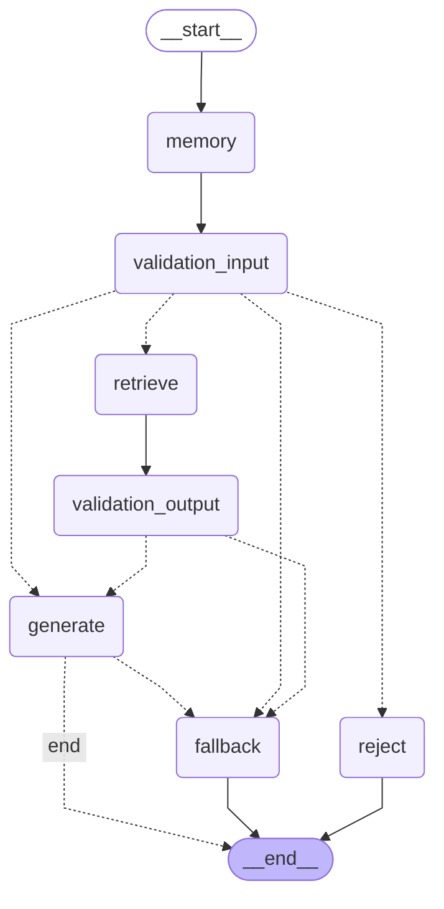

# Agent Graph Visualization

```mermaid
---
config:
  flowchart:
    curve: linear
---
graph TD;
  __start__([<p>__start__</p>]):::first
  memory(memory)
  validation_input(validation_input)
  retrieve(retrieve)
  validation_output(validation_output)
  generate(generate)
  fallback(fallback)
  reject(reject)
  __end__([<p>__end__</p>]):::last
  __start__ --> memory;
  generate -. &nbsp;end&nbsp; .-> __end__;
  generate -.-> fallback;
  memory --> validation_input;
  retrieve --> validation_output;
  validation_input -.-> fallback;
  validation_input -.-> generate;
  validation_input -.-> reject;
  validation_input -.-> retrieve;
  validation_output -.-> fallback;
  validation_output -.-> generate;
  fallback --> __end__;
  reject --> __end__;
  classDef default fill:#f2f0ff,line-height:1.2
  classDef first fill-opacity:0
  classDef last fill:#bfb6fc

```

